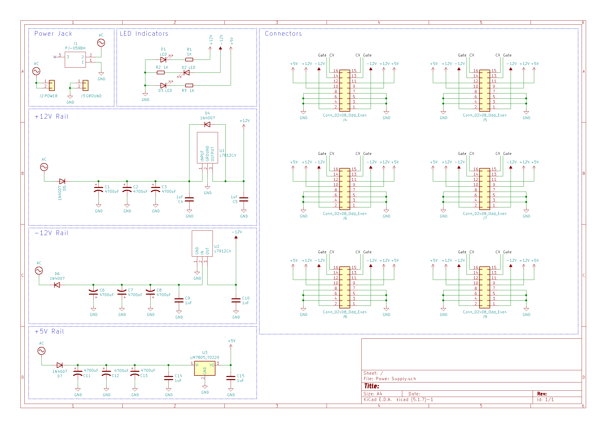
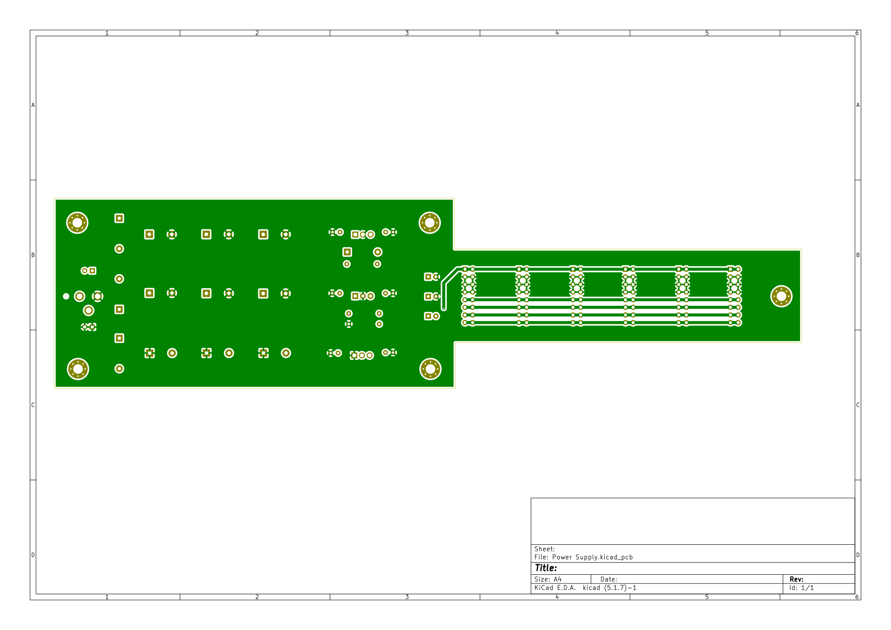

# Power Supply

This power supply uses an L7812, L7912 and LM7805 as voltage regulators to create +12V, -12V and +5V power rails. Each voltage regulator has a 1uF capacitor tied to ground on both the input and output as well as 3 4700uF capacitors as buffer from the power input.

There are 6 IDC, 16 pin, headers for powering modules. The board has each row marked and a number '1' near the red stripe row.

## 3D Render

## Schematic

## Layout

#### Front

#### Back
